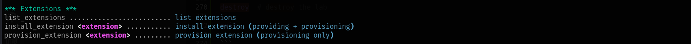

## Deploying GOAD Labs with Ludus on Proxmox

The best setup for GOAD labs in a homelab is on a Mini-PC.
You can setup GOAD labs in the cloud and on general purpose server hardware for specific usecases.
This guide is suitable for a homelab and caters to individuals who need to practice and repeatedly deploy labs for various experiments.

## Requirements

1. Proxmox server resources:
- Storage 500GB+ , 1TB (Recommended)
- 8 Cores minimum, more is better (to run multiple labs simulteneously)
- 32GB RAM minimum
2. Ludus installed on your Proxmox server
4. Admin user created with API key
5. Windows and Linux OS templates added to Ludus

## Step 1: Install Ludus
Install Ludus on Proxmox
```sh
# Use root privileges
curl -s https://ludus.cloud/install | bash
chmod +x install.sh
./install.sh
```

Ludus creates a root user. Obtain the API key using the command below.
```sh
ludus-install-status
# Ouput
Root API key: ROOT.yJ+vlqUzwzV%8UiWrPmaQiVuV-wwN8JTnenARbTG
```
Create another user and assign that user an admin role - Goad Admin user
```sh
export LUDUS_API_KEY='ROOT.yJ+vlqUzwzV%8UiWrPmaQiVuV-wwN8JTnenARbTG'

ludus user add --name "Goad Admin" --userid GA --admin --url https://127.0.0.1:8081
```
If the API key conatins a % - add another % sign to escape the symbol
This `GA.Sw=hWcCFUHs=32Lq8cDGNwtn_O2H%ft1ecRhAwVp` becomes `GA.Sw=hWcCFUHs=32Lq8cDGNwtn_O2H%%ft1ecRhAwVp`

Save the admin user's API key. Export it as a variable
```sh
export LUDUS_API_KEY='GA.Sw=hWcCFUHs=32Lq8cDGNwtn_O2H-ft1ecRhAwVp'
```

## Step 2: Add Required Templates

On the Ludus server, add the Windows templates:
Clone the ludus repo

```sh
git clone https://gitlab.com/badsectorlabs/ludus
cd ludus/templates
ls -la
ludus templates list
# Add any missing templates
# Make sure all templates in the folder are added
ludus templates add -d win2019-server-x64 
ludus templates add -d win2016-server-x64
# Check the templates added to ludus
ludus templates list
# Build templates
ludus templates build
```

Wait for templates to build 
```sh
# In another terminal check progress
ludus templates list
```
NOTE:
- You can edit the templates created in Proxmox to customize the VM specifications.
- You want to limit the VM resources to what your proxmox server can accomodate.
- Give the VMs 4GB RAM, 2 vCPU if you have minimum 32GB RAM and 8 vCPU
- Enter the Proxmox dashboard, click on each template and edit the hardware specs for RAM and Processors (vCPU)


### The recommended way to deploy GOAD Ranges/Labs
1. Setup Ludus to manage the Proxmox server (the infrastructure layer)
2. Use the GOAD Script from Orange CyberDefense to manage the GOAD Ranges/Labs
*It's a wrapper script with an interactive menu that relies on ludus to provision labs*

## Method 1: Using a Single Account to create GOAD Ranges

### Option A: Create a GOAD lab with the first user created 
1. You already created your first user with the admin role and exported the API key variable into the current terminal session. *That's enough to get started with your first lab or second. All labs created will belong to this account.*


2. Clone and Setup GOAD Script

```sh
git clone https://github.com/Orange-Cyberdefense/GOAD.git
cd GOAD
# Recommended to use poetry to create python virtual environment
pip install poetry
poetry env use python3.11
source $(poetry env info --path)/bin/activate
poetry install
```

NOTE: If you get any errors about unmet dependencies - fix them with this command replacing the packages with what is provided in the output

```sh
poetry run pip install --upgrade urllib3 chardet charset-normalizer requests
```

```sh
# Ensure you are using a user with the admin role. Export the Goad Admin user API ky and run the Goad script
# Run the GOAD script once to setup the goad.ini configuration file
./goad.sh -p ludus

exit
```

### Now you need to edit the goad.ini config file

To use one account for all your lab deployments, change the setting under [ludus] `use_impersonation = no`.
The value "no" ensures that GOAD uses the user API key exported. Change this value for your desired setup.
`use_impersonation = yes` will use the admin role of the user API key exported to create a seperate user for each lab the script creates.

```sh
[ludus]
; api key must not have % if you have a % in it, change it by a %%
ludus_api_key = GA.Xx=xxxxxxxxx=32xxxxxxXXXxxx_xxxxxxxxxx
use_impersonation = no
```

Now return to the GOAD script menu. Tip: always exit out of the script menu to make changes to the goad.ini configuration file.
Changes are applied next time you run the script.

```sh
# Use the command "exit" to return to the linux shell at any point
./goad.sh -p ludus

help    # displays commands

check   # checks the settings the script will use

status  # displays information about existing ranges

set_lab GOAD    # sets the GOAD lab to deploy. Options: GOAD, GOAD-Light, GOAD-Mini, NHA, SCCM

set_ip_range 10.2.10    # set the first 3 octets of the IP range 10.2.10, 10.3.10 e.t.c

install # deploys a GOAD range
```

### Option B: Create a different user for a every GOAD Range using the GOAD Script

In this option you do not need to worry about creating a user manually. The GOAD Script will do it for you.

1. Export the admin user API key
```sh
export LUDUS_API_KEY='GA.Sw=hWcCFUHs=32Lq8cDGNwtn_O2H-ft1ecRhAwVp'
```
2. Edit the goad.ini configuraiton file. Set user impersonation value to "yes"

```sh
[ludus]
; api key must not have % if you have a % in it, change it by a %%
ludus_api_key = GA.Xx=xxxxxxxxx=32xxxxxxXXXxxx_xxxxxxxxxx
use_impersonation = yes
```
3. Now run the GOAD Script

```sh
# Use the command "exit" to return to the linux shell at any point
./goad.sh -p ludus

check   # checks the settings the script will use

status  # displays information about existing ranges

set_lab GOAD-Light   # sets the GOAD lab to deploy. Options: GOAD, GOAD-Light, GOAD-Mini, NHA, SCCM

set_ip_range 10.2.10    # set the first 3 octets of the IP range 10.2.10, 10.3.10 e.t.c

install # deploys a GOAD range
```

## Method 2: Creating GOAD Ranges with seperate accounts manually created using ludus

You can deploy multiple ranges by creating a user for each range to isolate them. The only advantage I see with this is customizing the lab name. A typical lab name looks like this: GOADae34e, GOADLightad34e.
You can create a user called "John Doe" with the user-id JD. The lab name will be JD-ae34e

NOTE: The subsequent users you create to deploy labs do not need to have the admin role. 
*(Keep in mind, you do not need to create a different user for each lab. Keep things simple and repeatable.)*

1. Create a basic user without the admin role for each range.
 
```sh
# Record your API keys in a text file to refer to them
ludus user add -n 'GOAD Full' -i GOADFULL --url https://127.0.0.1:8081

ludus user add -n 'GOAD Light' -i GOADLIGHT --url https://127.0.0.1:8081

```

2. Export each user's API key before running the GOAD Script commands each time you're creating an isolated lab.

```sh
export LUDUS_API_KEY='GOADLIGHT.7QWRe4cKmcz9HGgi+Gid1j5ZCs=bLE0Eo@kNtXtr'

```
The GOAD Script should use the user whose API key is exported. Export a different API key this for each range/lab you need to create.
NOTE: Sometimes the user the GOAD Script uses may not change from the previous time you run the script.
Always confirm by running the check command before installing a range.

To ensure you are using the correct user when you run the script, you can add that user's API key directly into the goad.ini configuration file. Example: `GA.Xx=xxxxxxxxx=32xxxxxxXXXxxx_xxxxxxxxxx`.

Make sure the value for `use_impersonation` is set to "no".

```sh
[ludus]
; api key must not have % if you have a % in it, change it by a %%
ludus_api_key = GOADLIGHT.Xx=xxxxxxxxx=32xxxxxxXXXxxx_xxxxxxxxxx
use_impersonation = no
```
3. Now run the GOAD Script
No need to set the lab IP range. The script handles this automatically.

```sh
# Use the command "exit" to return to the linux shell at any point
./goad.sh -p ludus

check   # checks the settings the script will use

status  # displays information about existing ranges

set_lab GOAD-Light   # sets the GOAD lab to deploy. Options: GOAD, GOAD-Light, GOAD-Mini, NHA, SCCM

install # deploys a GOAD range
```

### :warning: If you encounter issues with a lab deploying 

You can destroy the lab and create it again. The deployment has to run untill it finishes and tells you if anything failed.

NOTE: You need to switch to the admin user to manage the ranges. Export the admin user's API key and run the GOAD Script. 
Use the commands `load` to enter into the desired lab context and `unload` to get out of a lab context.

```sh
# Use the command "exit" to return to the linux shell at any point
./goad.sh -p ludus

load    # load the desired lab 

destroy  # destroy the lab

exit
```
### Repeat steps 2 and 3 above.


## Script Extensions: Create GOAD Full + Elastic SIEM

The GOAD Script will handle this automatically. You just install the preferred extension in the desired lab and run


```sh
# Use the command "exit" to return to the linux shell at any point
./goad.sh -p ludus

load    # load the desired lab 

help    # list commands

list_extensions  # display available extensions

install_extension elk   # install Elastic SIEM extension
```

## Manage Ranges Using Ludus

### Switch to the user with the admin role
```sh
export LUDUS_API_KEY='GA.v3gfHmYWIgFh11p+LHhXX+7jsyztP9ddnG%%ulkuw'

ludus users list all    # view created users

ludus range list

ludus range status
```

## Monitoring Deployments

Watch the deployment logs in a separate terminal:
```sh
ludus --user GOADFULL range logs -f # Use the user ID to specify the user 
```

Check range status:
```sh
ludus --user GOADFULL range status
```

## Post-Deployment

Take Snapshots
```sh
ludus --user GOADFULL range snapshot -n "clean-install"

ludus --user GOADLIGHT range snapshot -n "clean-install"
```


## Troubleshooting

### Having DNS Errors? 

If DNS errors occur during provisioning:
```sh
# On affected VM, remove the 10.ID.10.254 DNS entry
Set-DnsClientServerAddress -InterfaceAlias "Ethernet" -ServerAddresses @("10.X.10.1")
```

### Removing Wireguard if you ever need to reinstall it. For example if you need to remove ludus and reinstall it.

```sh
 wg-quick down wg0
 systemctl stop wg-quick@wg0
 systemctl disable wg-quick@wg0
 ip link delete dev wg0
 rm -fr /etc/wireguard/
 apt remove wireguard wireguard-tools

 ```

 ### Remove a user's range
NOTE: Use the GOAD Script to remove ranges created by the script. You can clean up the ludus database by removing users created by the script.
```sh
ludus users list all    # Obtain user-IDs

ludus user rm -i GOADFULL --url https://127.0.0.1:8081  # remove user with user-ID -i 

ludus user rm -i GOADFULL --url https://127.0.0.1:8081
```